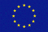

# Marine Profiles of the OGC Sensor Web Enablement Standards

## Contents

1. [General Considerations](01_General_Considerations.md)
2. [Related International Initiatives](02_International_Initiatives.md)
3. [Data Models and Encodings](03_Data_Models_And_Encodings.md)
4. [Metadata Models and Encodings](04_Metadata_Models_And_Encodings.md)
5. [Interfaces for Pull-based Data Access](05_Pull_Access.md)
6. [Interfaces for Push-based Data Access (Publish Subscribe)](06_Push_Access.md)
7. [Interfaces for Tasking Sensors](07_Tasking.md)

## Copyright Notice
Copyright © 2016, Simon Jirka and the Marine SWE Profiles Working Group

The authors grant third parties the right to use and distribute all or parts of this document, provided that the authors and the document are properly referenced.

THIS DOCUMENT IS PROVIDED BY THE COPYRIGHT HOLDERS AND CONTRIBUTORS "AS IS" AND ANY EXPRESS OR IMPLIED WARRANTIES, INCLUDING, BUT NOT LIMITED TO, THE IMPLIED WARRANTIES OF MERCHANTABILITY AND FITNESS FOR A PARTICULAR PURPOSE ARE DISCLAIMED. IN NO EVENT SHALL THE COPYRIGHT OWNER OR CONTRIBUTORS BE LIABLE FOR ANY DIRECT, INDIRECT, INCIDENTAL, SPECIAL, EXEMPLARY, OR CONSEQUENTIAL DAMAGES (INCLUDING, BUT NOT LIMITED TO, PROCUREMENT OF SUBSTITUTE GOODS OR SERVICES; LOSS OF USE, DATA, OR PROFITS; OR BUSINESS INTERRUPTION) HOWEVER CAUSED AND ON ANY THEORY OF LIABILITY, WHETHER IN CONTRACT, STRICT LIABILITY, OR TORT (INCLUDING NEGLIGENCE OR OTHERWISE) ARISING IN ANY WAY OUT OF THE USE OF THIS DOCUMENT, EVEN IF ADVISED OF THE POSSIBILITY OF SUCH DAMAGE.

## Acknowledgements

The profiles defined in this document have been developed within a series of research projects including
* AODN
* BRIDGES
* ENVRIplus
* EUROFLEETS/EUROFLEETS2
* FixO3
* FRAM
* IOOS
* Jerico/Jerico-Next
* NeXOS
* ODIP/ODIP 2
* RITMARE
* SeaDataNet
* SenseOcean
* X-DOMES

BRIDGES (Bringing together Industry for the Development of Glider Environment) is funded by the Horizon 2020 Framework Programme for Research and Innovation (H2020-BG-2014-2) of the European Union under grant agreement number 635359.

FixO3 (Fixed Point Open Ocean Observatories Network) is funded by the Sevents Framework Programme (FP7) for Research and Innovation (FP7-INFRASTRUCTURES-2012-1-RTD) of the European Union under grant agreement number 312463.

NeXOS (Next generation, Cost-effective, Compact, Multifunctional Web Enabled Ocean Sensor Systems Empowering Marine, Maritime and Fisheries Management) is funded by the Sevents Framework Programme (FP7) for Research and Innovation (FP7-OCEAN-2013) of the European Union under grant agreement number 614102.

ODIP 2 (Extending the Ocean Data Interoperability Platform) is funded by the Horizon 2020 Framework Programme for Research and Innovation (H2020-INFRASUPP-2014-2) of the European Union under grant agreement number 654310.

**TODO: ADD FURTHER Acknowledgements**
